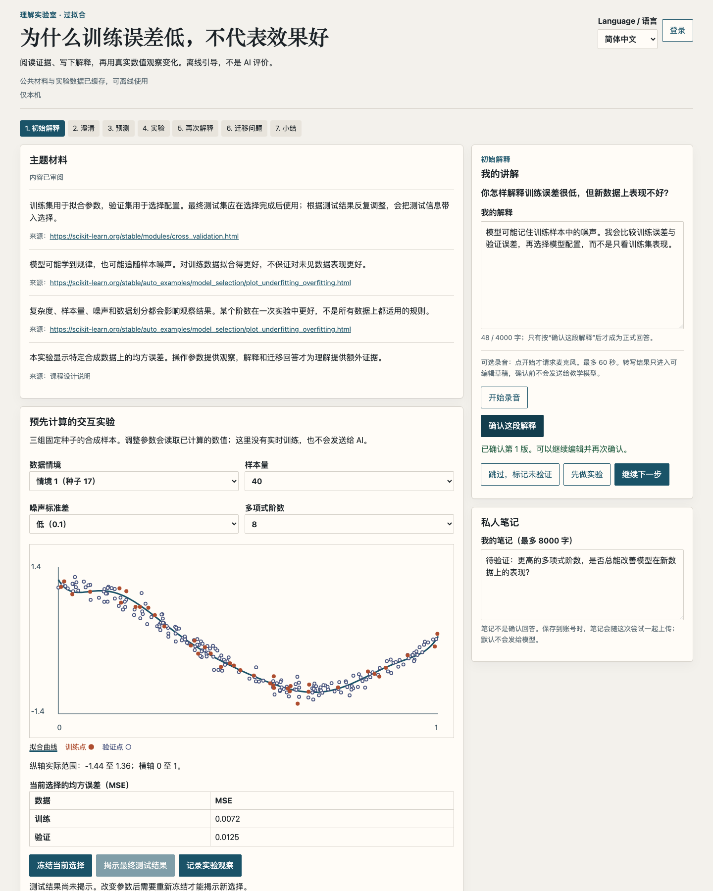
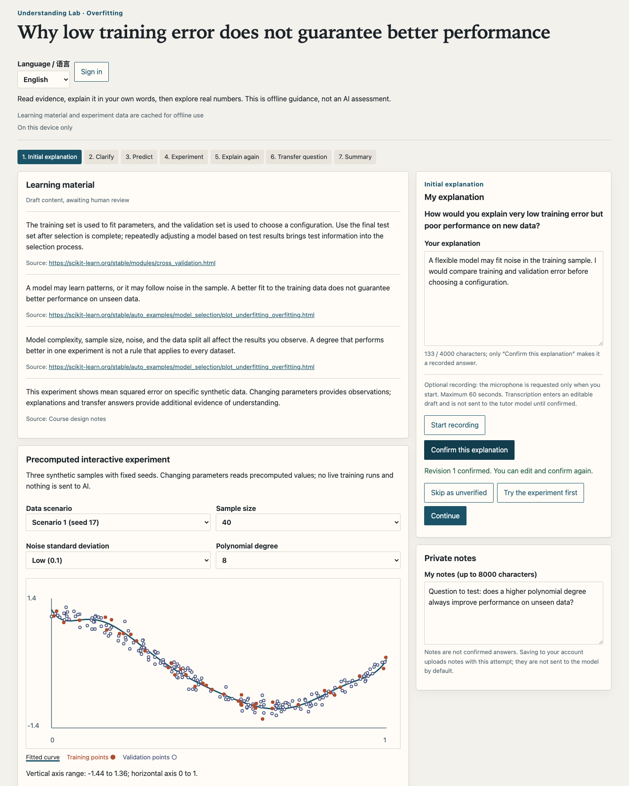
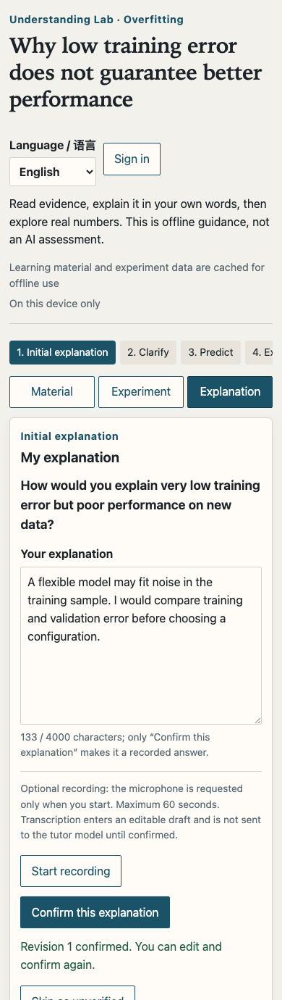

<h1 align="center">理解实验室 · Understanding Lab</h1>

<p align="center"><strong>讲出来。做实验。真正理解。</strong></p>
<p align="center"><a href="README.md">English</a> · 简体中文</p>

<p align="center">
  <a href="https://github.com/tsumon/understanding-lab/actions/workflows/ci.yml?query=branch%3Acodex%2Funderstanding-lab-mvp"></a>
  <a href="LICENSE"></a>
</p>

理解实验室是一个本机优先的学习应用，用来检验你是否理解了一个 AI 概念。首个主题是过拟合：先用自己的话解释，再作出预测、探索可复现的实验，然后重新解释并回答迁移问题。默认情况下，匿名学习记录只保存在当前浏览器。

## 界面预览

<p align="center"><a href="assets/readme/desktop-zh-CN.png"></a></p>

<p align="center">
  <a href="assets/readme/desktop-en.png"></a>
  &nbsp;&nbsp;
  <a href="assets/readme/mobile-en.png"></a>
</p>

图片展示本机应用中的合成示例，不是模型生成的教学反馈。

## 你可以做什么

- **本机学习：** 草稿和笔记留在浏览器中；构建后的应用可缓存供离线使用。
- **切换语言：** 英文与简体中文随时切换，不改写回答、笔记、实验状态或历史反馈。偏好保存在当前浏览器。
- **验证解释：** 比较 324 组预计算配置的曲线与训练 / 验证误差，冻结选择后再揭示测试误差。
- **自主控制数据：** 本机导出学习记录；配置服务后，分别选择保存到账号、向导师发送或请求语音转写。

## 学习流程

**解释 → 预测 → 实验 → 重新解释 → 迁移 → 回顾。** 你可以跳过提示，也可以返回修改答案。在过拟合实验中，先选择模型，再揭示留出的测试误差；揭示后若更改设置，结果会标记为受到污染。实验目录包含 324 种可复现配置。数值由合成数据生成，不能代表所有真实数据集。

没有账号或 AI 服务也能完成文字学习。向可选导师发送答案、将记录保存到账户，是两个独立操作，需要分别同意。语音转写也为可选功能：开始录音不会发送音频，只有明确请求转写后才会发送。导师和转写默认关闭。启用导师后，服务每次启动都可能进行一次计费的供应商探测。配置步骤见[入门指南](docs/getting-started.md)。

## 本机运行

需要 Node.js 22.12 或更新版本，以及 npm。已验证的版本为 Node 22.23.2 / npm 10.9.8。`better-sqlite3` 含原生模块；若平台没有匹配的预编译文件，安装可能需要本机编译工具。

```sh
git clone --branch codex/understanding-lab-mvp https://github.com/tsumon/understanding-lab.git
cd understanding-lab
npm ci
npm run dev
```

打开 Vite 显示的本机地址。匿名文字课程无需 `.env`、账号、模型密钥或服务端。离线使用与可选账号、导师、转写服务请阅读[入门指南（英文）](docs/getting-started.md)与[部署指南（中文）](docs/deployment.md)。

## 项目检查

```sh
npm run typecheck
npm test
npm run experiment:test
npm run build:offline
```

实验数值检查还需要 `uv` 和 Python 3.12.13；环境准备与浏览器检查见[贡献指南（英文）](CONTRIBUTING.md)。CI 使用确定性测试夹具，不调用付费模型。

## 当前范围

目前提供过拟合一课，采用响应式 Web 应用；不提供托管服务或原生安装包。真实模型教学质量、人类审阅（包括英文翻译）、真实 OAuth 与真机语音仍待验收。WebKit 草稿 / 小结存在尚未解决的间歇回归。工程检查通过不等于学习效果得到验证。

## 文档

- [入门指南](docs/getting-started.md)（英文）：本机运行及可选服务配置
- [贡献指南](CONTRIBUTING.md)（英文）：修改、检查和数据处理要求
- [部署指南](docs/deployment.md)与[隐私边界](docs/privacy.md)（中文）
- [许可证](LICENSE)与[第三方声明](THIRD_PARTY_NOTICES.md)

## 许可证

原创项目源代码和文档依照 [MIT 许可证](LICENSE)提供，但依赖和其他材料仍受各自条款约束，详见[第三方声明](THIRD_PARTY_NOTICES.md)。
